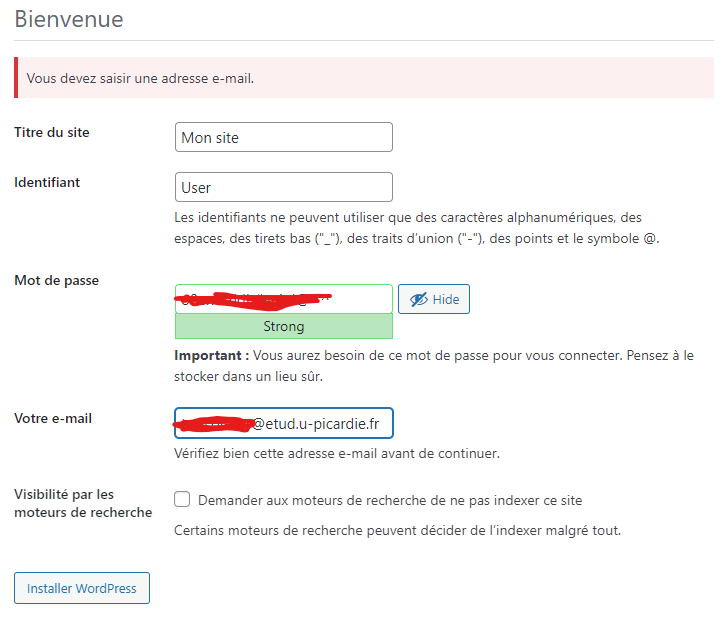

El famouso : `sudo -s`

# Prérequis  
  
`apt update`  
`apt install docker.io`  
  
`systemctl start docker`  
`systemctl enable docker`  
  
`docker login -u tom60chat`  v
  
`docker run hello-world`  
`docker pull alpine`

Vous devriez avoir ça à la fin :  


# Cours (Vous pouvez ignorer cette partie)
  


`docker create -i -t --name alp1 alpine`

`docker run -d alpine /bin/sh -c "while true; do echo hello world; sleep 1; done"`


# Entrainement je pense (toujours pas le TD)

`docker pull httpd`

`docker run -d -p 8080:80 --rm --name Apache httpd`

`curl -i http://localhost:8080`  


`docker network create mynet1`

`docker network list`  


`docker run -t -d --rm --name a1-mynet1 --network mynet1 alpine`

`docker exec a1-mynet1 hostname -i`  


`docker run -t -d --rm --name a2-mynet1 --network mynet1 alpine`

`docker exec a2-mynet1 hostname -i`  


`docker exec a2-mynet1 ping -c 3 a1-mynet1`  


`docker volume create web1`

`docker volume inspect web1`  


`docker run -d -p 8081:80 --name=dock1 -v web1:/usr/local/apache2/htdocs httpd`

`docker inspect dock1`   
...

`ls -l /var/lib/docker/volumes/web1/_data`

`docker volume create web2`

`nano /var/lib/docker/volumes/web2/_data/index.html`
```html
<html><body>Super</body></html>
```

`docker run -d -p 8082:80 --name=dock2 -v web2:/usr/local/apache2/htdocs httpd`

`docker inspect dock2`

`curl http://localhost:8082`  


# TD1 - Docker

1. `docker pull wordpress:latest`

2. `docker pull mariadb:latest`

3. `docker network create rezorgi`

4. `docker volume create vol6_bd`

5. `docker run -d --name=dock6-bd -v vol6_bd:/var/lib/mysql --network rezorgi -e MYSQL_ROOT_PASSWORD=root -e MYSQL_DATABASE=bdd -e MYSQL_USER=user -e MYSQL_PASSWORD=password --rm mariadb`

6. `docker ps`

7. Les ports ...

8. `docker run -d -p 3101:80 --name=dock6-wp -v vol6_bd:/var/lib/mysql --network rezorgi -e WORDPRESS_DB_HOST=dock6-bd:3306 -e WORDPRESS_DB_USER=user -e WORDPRESS_DB_PASSWORD=password -e WORDPRESS_DB_NAME=bdd --rm wordpress`

9. `docker ps`

10. `docker logs [id]`

11. `nano /root/td31.sh`
   ```
   docker pull wordpress:latest
   docker pull mariadb:latest

   docker network create rezorgi
   docker volume create vol6_bd

   docker run -d --name=dock6-bd -v vol6_bd:/var/lib/mysql --network rezorgi -e MYSQL_ROOT_PASSWORD=root -e MYSQL_DATABASE=bdd -e MYSQL_USER=user -e MYSQL_PASSWORD=password --rm mariadb
   docker run -d -p 3101:80 --name=dock6-wp -v vol6_bd:/var/lib/mysql --network rezorgi -e WORDPRESS_DB_HOST=dock6-bd:3306 -e WORDPRESS_DB_USER=user -e WORDPRESS_DB_PASSWORD=password -e WORDPRESS_DB_NAME=bdd --rm wordpress
   ```

Pour ce connecter au serveur, vous pouvez avec putty :   


Ensuite commencer l'installation de WordPress :
http://localhost:3101

Puis "Installer WordPress"
