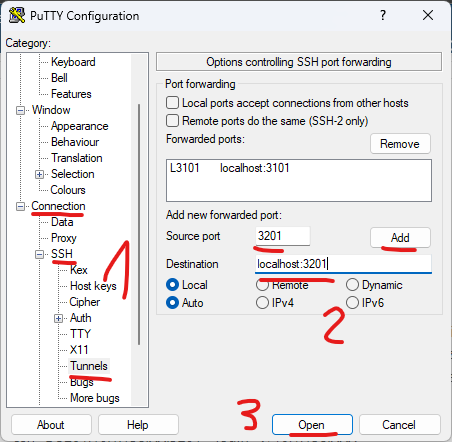

# TD2 - Docker-compose  

`apt update`  
`apt install docker-compose`  

`mkdir /root/projet1`  
`cd /root/projet1`  

`nano docker-compose.yml`
```yml
version: '2'

services:  
  wordpress:
    image: wordpress:latest
    container_name: dock6-wp2
    depends_on:
      - mariadb
    ports:
      - "3201:80"
    volumes:
      - vol6_bd2:/var/lib/mysql
    environment:
      WORDPRESS_DB_HOST: dock6-bd2:3306
      WORDPRESS_DB_USER: user
      WORDPRESS_DB_PASSWORD: password
      WORDPRESS_DB_NAME: bdd
    networks:
      - rezorgi2
    restart: always
  
  mariadb:
    image: mariadb:latest
    container_name: dock6-bd2
    volumes:
      - vol6_bd2:/var/lib/mysql
    environment:
      MYSQL_ROOT_PASSWORD: root
      MYSQL_DATABASE: bdd
      MYSQL_USER: user
      MYSQL_PASSWORD: password
    networks:
      - rezorgi2
    restart: always

volumes:
    vol6_bd2: {}
    
networks:
    rezorgi2: {}
```

`docker-compose up -d`  
`docker-compose ps`  

Pour ce connecter au serveur, vous pouvez avec putty :   


Ensuite commencer l'installation de WordPress :
http://localhost:3201

Puis "Installer WordPress"