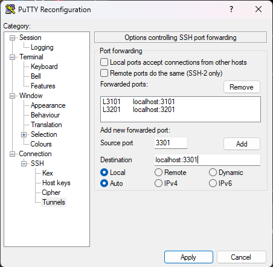

# TD3 - Swarm

1. `docker swarm init`  
2. `nano docker-compose.yml`
    ```yml
    version: '3'
    
    services:  
      vol6_bd3:
        image: wordpress:latest
        depends_on:
          - mariadb
        ports:
          - "3301:80"
        volumes:
          - vol6_bd3:/var/lib/mysql
        environment:
          WORDPRESS_DB_HOST: dock6-bd3:3306
          WORDPRESS_DB_USER: user
          WORDPRESS_DB_PASSWORD: password
          WORDPRESS_DB_NAME: bdd
        networks:
          - rezorgi3
        restart: always
      
      dock6-bd3:
        image: mariadb:latest
        volumes:
          - vol6_bd3:/var/lib/mysql
        environment:
          MYSQL_ROOT_PASSWORD: root
          MYSQL_DATABASE: bdd
          MYSQL_USER: user
          MYSQL_PASSWORD: password
        networks:
          - rezorgi3
        restart: always
    
    volumes:
        vol6_bd3: {}
        
    networks:
        rezorgi3: {}
    ```
   `docker stack deploy -c docker-compose1.yml wordpress`

   Pour ce connecter au serveur, vous pouvez avec putty :
   

   Accéder à l'interface de WordPress :
   http://localhost:3201